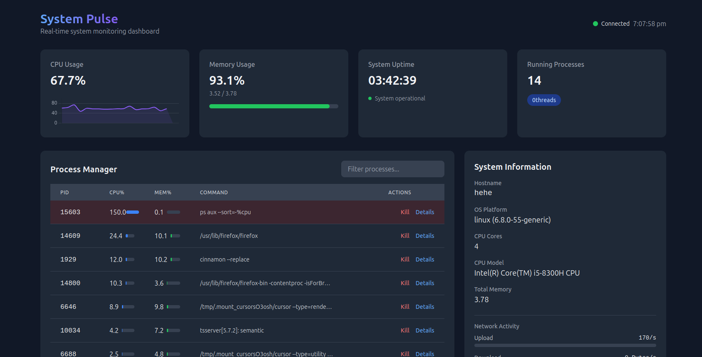

# Real-Time Process Monitoring Dashboard 🖥️📊

 

A modern, cross-platform monitoring tool that provides real-time insights into system performance, processes, and resource utilization with beautiful visualizations.

## Features ✨

- **Real-time monitoring** of CPU, memory, and processes
- **Cross-platform** support (Windows, Linux, macOS)
- **Interactive visualizations** with charts and gauges
- **Process management** (view and kill processes)
- **System information** overview
- **Network activity** monitoring
- **Responsive design** works on desktop browsers
- **Dark/light mode** (coming soon)

## Technologies Used 🛠️

### Frontend
- HTML5, CSS3, JavaScript
- [Tailwind CSS](https://tailwindcss.com/) - Modern utility-first CSS framework
- [Socket.IO](https://socket.io/) - Real-time client-server communication
- [Chart.js](https://www.chartjs.org/) - Interactive data visualizations
- [Animate.css](https://animate.style/) - CSS animations

### Backend
- [Node.js](https://nodejs.org/) - JavaScript runtime
- [Express](https://expressjs.com/) - Web framework
- [Socket.IO](https://socket.io/) - Real-time engine
- [systeminformation](https://www.npmjs.com/package/systeminformation) - Cross-platform system info
- [pidusage](https://www.npmjs.com/package/pidusage) - Process statistics

## Installation Guide 🚀

### Prerequisites
- Node.js (v14 or higher)
- npm (comes with Node.js)
- Git (optional)

### Setup Instructions

1. **Clone the repository**:
   
   ```bash
   git clone https://github.com/yourusername/process-monitor.git
   cd process-monitor
   
Install dependencies:

```bash
npm install
```

Configure the application:

- Edit server.js to change port or other settings if needed

- The frontend is configured to connect to http://localhost:3000 by default

Run the server:

```bash
node server.js
```

Open the dashboard:

- Open index.html in your browser

- Or host it using a local server like Live Server (VS Code extension)

Usage Guide 📖

Dashboard Overview:

- The main view shows CPU, memory, and process statistics

- Real-time updates every 2 seconds

Process Management:

- View all running processes sorted by CPU usage

- Kill processes using the "Kill" button (requires appropriate permissions)

System Information:

- View detailed system specs in the right panel

- Monitor network activity

CPU Core Visualization:

- See individual core utilization at the bottom of the dashboard

Project Structure 📂
```
process-monitor/
├── index.html            # Frontend HTML file
├── server.js             # Backend server code
├── package.json          # Node.js dependencies
├── README.md             # This file
└── (screenshot.png)      # Dashboard screenshot
```


# Troubleshooting ⚠️

## Common Issues

### No processes showing:
- Ensure your system has appropriate permissions
- Check server console for errors
- Verify the `systeminformation` package is installed

### Connection issues:
- Make sure the server is running
- Check that the frontend is connecting to the correct URL
- Verify no firewall is blocking the connection

### Performance problems:
- Reduce the update frequency
- Limit the number of processes displayed

### Contributing 🤝
- Contributions are welcome! Please follow these steps:

- Fork the repository

- Create a new branch (git checkout -b feature/awesome-feature)

- Commit your changes (git commit -m 'Add awesome feature')

- Push to the branch (git push origin feature/awesome-feature)

- Open a Pull Request

### Future Enhancements 🔮
- Add process filtering and search

- Implement historical data logging

- Add authentication for security

- Create mobile-friendly version

- Add alerting system for thresholds

- Implement light/dark mode toggle

### License 📜
- This project is licensed under the MIT License - see the LICENSE file for details.

### Acknowledgments 🙏
- The systeminformation package authors

- Tailwind CSS team for the amazing framework

- Socket.IO for real-time magic

Happy Monitoring! 🎉


## How to Use This README

1. Save this content as `README.md` in your project root
2. Replace placeholder values (like `yourusername`) with your actual information
3. Add a real screenshot (name it `screenshot.png` and place in root)
4. Create a `LICENSE` file if you want to specify licensing terms
5. Update the "Future Enhancements" section as you implement features

This README provides:
- Clear project description
- Visual elements (will need actual screenshot)
- Installation and usage instructions
- Technical details
- Contribution guidelines
- License information
- Room for growth with future enhancements

The markdown formatting makes it look great on GitHub and other platforms that support Markdown rendering.
